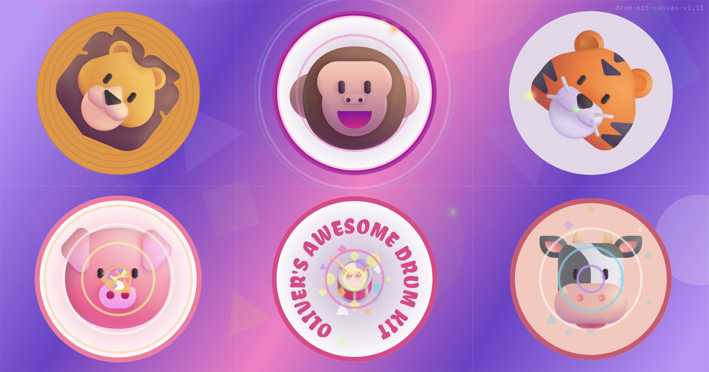

# Oliver's Drum Kit - Canvas Edition



A browser-based drum kit built with HTML, CSS, and JavaScript, made as a fun interactive toy for my grandson Oliver.

Live at [drum-kit-canvas.philipnewborough.co.uk](https://drum-kit-canvas.philipnewborough.co.uk)

All rendering is done on a single HTML `<canvas>` element via WebGL (WebGL 2 with a WebGL 1 fallback) using a `requestAnimationFrame` loop. Audio playback is handled by [Howler.js](https://howlerjs.com/).

## Features

- **6 instruments** — crash cymbal, tom, hi-hat, snare, bass drum, floor tom
- **Tap to play** — tap or click any instrument to trigger its sound
- **Looping** — press and hold an instrument for 500 ms to start it looping at its own interval; hold again to stop. Layer multiple loops to build a beat
- **Combo triggers**
  - Hit the same drum 3 times quickly → solo
  - Alternate between two drums (A→B→A→B) → duo solo
  - Hit all 6 instruments at least once → classic drum solo
  - Combos are disabled while any loop is active
- **Animal sound easter eggs** — each per-instrument solo ends with a surprise animal sound (crash → lion, hi-hat → tiger, tom → monkey, snare → pig, floor tom → moo)
- **BPM control** — a ±10 BPM control appears whenever at least one loop is active; range 60–200 BPM, default 120 BPM; all active loops stay locked to the same rhythmic grid
- **Reverb** — a toggle button applies Web Audio API convolver reverb to the master output
- **WebGL rendering** — all visuals drawn on a single `<canvas>` using WebGL (WebGL 2 / WebGL 1 fallback) across seven layers: animated gradient background (GLSL fragment shader), cell dividers, background shapes, looping glow overlays, instrument images (SVG rasterised to textures), sparkle particles, and expanding ring annuli; four colour themes cycle on each hit
- **PWA** — includes a service worker and Web App Manifest for offline use and home-screen installation
- **Responsive layout** — 2×3 grid in portrait, 3×2 in landscape

## Project Structure

```
public/
  index.html          # App shell; splash + help modals; SW registration
  manifest.json       # PWA manifest
  sw.js               # Service worker (precache + cache-first strategy)
  audio/              # MP3 samples (bass, crash, floortom, hihat, snare, tom)
  css/
    reset.css
    main.css
  fonts/
  img/                # SVG instrument illustrations + PNG icons
  js/
    main.js           # All game logic and canvas rendering
    vendor/
      howler.js
cache-bust.js         # Node script — hashes main.css & main.js, updates ?v= query strings in index.html and sw.js
```

## Development

**Cache-bust assets** (run after editing `main.css` or `main.js`):

```bash
npm run cache-bust
```

This computes an MD5 hash of each file, updates the `?v=` query string in `index.html` and `sw.js`, and bumps the service worker cache name so stale caches are purged on the next visit.

## Deployment

Deploy the contents of `public/` to any static host.
